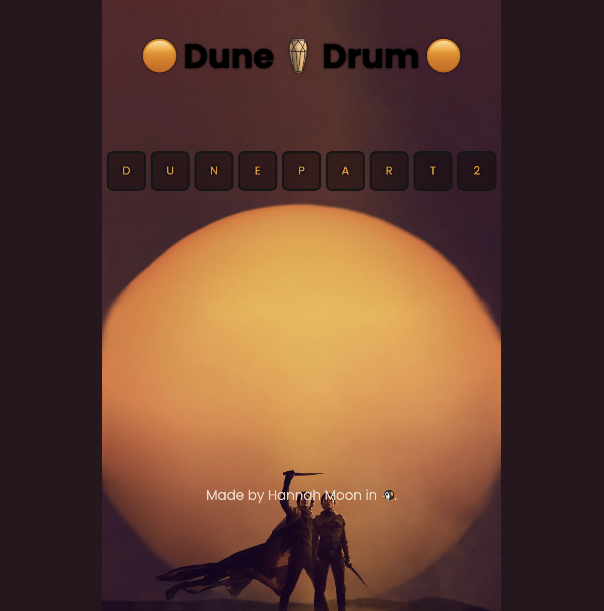

<h2 align="center">
  Java Script: Interactive Dune Part 2 Themed Drum  
</h2>

<h3 align="center">
  Interactive Object + Higher Order Function + Event Listener + Callback Function
</h3>

  

 

## Live Demo
You can fork this repo to modify and make changes of your own. 
Click  <a href="https://hannah-moon.github.io/15_JS_Dune2_Drum/">here</a> to try the drum on the live demo site.
 

## Built With

 </a> 

When writing JavaScript, I coded along with <a href="https://twitter.com/yu_angela?ref_src=twsrc%5Egoogle%7Ctwcamp%5Eserp%7Ctwgr%5Eauthor">Dr.Angela Yu<a/> and utilized "Interactive Object + Higher Order Function + Event Listener + Callback Function."
 
  
## Music credit 
I give all music credit to <a href="https://pixabay.com/music/">Pixabay.com</a>
 

## How to play the <a href="https://hannah-moon.github.io/15_JS_Dune2_Drum/">drum</a>? 
1. You can either click the buttons with your mouse or press the keys on your keyboard to play the sounds.
2. Note that the sound may continue to play longer than expected, so be prepared for extended sounds.
3. If you press multiple buttons and find the resulting music to be unpleasant or too noisy, simply reload the window to start fresh.

* I'm not a musician, so the sound combinations may not be pleasing to everyone's ears.
 

## Show your support

Please give a ⭐ if you like this work. Thank you!
 

## License

And, of course:

MIT: <https://en.wikipedia.org/wiki/MIT_License>
